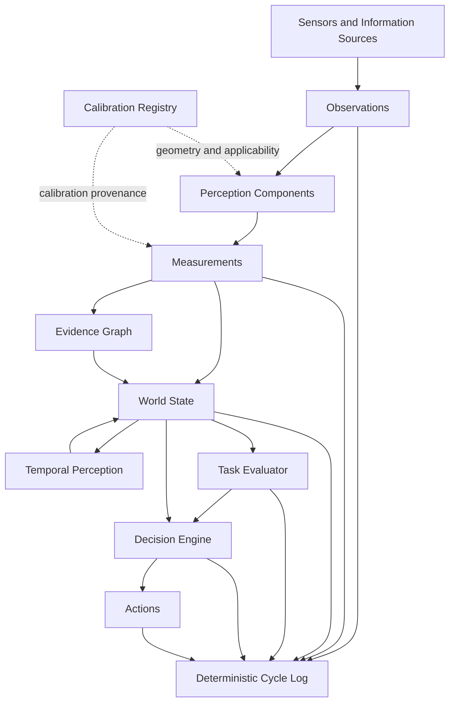

# SIE - Spatial Intelligence Engine

Engineering architecture for robotic perception, spatial reasoning and decision support.

## Vision

Robots should reason about the physical world using measurable, verifiable and traceable information.

SIE is an engineering architecture that transforms raw sensor observations into reliable spatial understanding for autonomous robotic systems.

Instead of relying on model-specific assumptions, SIE builds decisions upon calibrated measurements, geometry and explicit evidence.

## Why SIE

Modern robotic software often treats AI models as the primary source of truth.

SIE follows a different philosophy:

- Measurements are trusted only after physical validation.
- Every decision is traceable.
- Every spatial value has an explicit reference frame.
- Every conclusion can be verified.

## Engineering Principles

- Geometry First
- Measured Reality over Predictions
- Evidence over Opinion
- Reference Frames Everywhere
- Replaceable AI Components
- Data Contracts Between Modules
- Engineering Validation First

## System Architecture

SIE transforms observations from sensors and other information sources into traceable measurements, spatial facts and engineering decisions. Calibration does not produce an observation. It defines whether an observation is suitable for physical measurement and how its geometry must be interpreted.



### Data Flow

1. Sensors and information sources produce structured `Observations`.
2. The Calibration Registry supplies sensor geometry and verifies calibration applicability.
3. Perception components use observations and applicable calibration to produce quantitative `Measurements`.
4. Measurements are expressed in physical units and explicitly linked to a `reference_frame` and calibration provenance.
5. The Evidence Graph preserves provenance from observation to measurement, decision and action.
6. The World State maintains the current structured representation of the physical environment.
7. Temporal Perception evaluates changes, stability and entity lifecycle across time.
8. The Task Evaluator assesses the World State against the active task.
9. The Decision Engine uses only the World State and Task Evaluator output to select an action.
10. The complete processing cycle is recorded in a deterministic log.

### Architectural Constraints

- Modules exchange structured Data Contracts rather than untyped internal data.
- Spatial values without an explicit `reference_frame` are invalid.
- Measurements produced under unknown, expired or unvalidated calibration are rejected.
- AI models are replaceable components and are not treated as authoritative sources of truth.
- Every engineering fact, decision and action must remain traceable to supporting evidence.
- Insufficient confidence must trigger additional observation, measurement or safe refusal.

## Current Status

SIE is currently in the engineering validation stage.

The active development focus is the Vision Core and calibration infrastructure required to produce physically meaningful spatial measurements.

### Baseline Completed

- Stereo camera calibration pipeline
- Correct physical left/right camera mapping
- Rectified stereo input pipeline
- ROI-based depth measurement
- Median-based distance estimation
- Temporal depth stabilization
- Confidence and measurement quality evaluation
- Cross-range stereo validation
- Geometry utilities for pixel-to-3D conversion
- Plane fitting experiments
- Baseline depth measurement validation rules
- Versioned calibration concept and calibration applicability checks

### Active Development

- Stereo calibration v3 validation
- Calibration Registry
- Structured `Observation` and `Measurement` contracts
- Measurement uncertainty propagation
- Target-specific ROI validation
- Point cloud quality evaluation
- Object dimension measurement
- World State representation

### Planned

- Temporal Perception
- Entity lifecycle tracking
- Multi-sensor fusion
- IMU integration
- Visual-Inertial Odometry
- SLAM
- Task Evaluator
- Decision Engine
- Action validation and execution contracts

## Validation Results

The published Vision Core baseline has been validated against physical reference measurements using a calibrated stereo camera system.

> Calibration v3 is currently under independent validation and is not yet used as the published engineering baseline.

### Stereo Calibration Baseline v2

| Metric | Value |
|---------|------:|
| Stereo RMS | **0.479 px** |
| Physical baseline | **65.10 mm** |
| Solved baseline | **64.305 mm** |
| Rectification median vertical error | **0.322 px** |

### Depth Measurement Validation

| Ground Truth | Measured | Absolute Error | Relative Error |
|--------------|---------:|---------------:|---------------:|
| 500 mm | 508.7 mm | +8.7 mm | 1.74% |
| 1000 mm | 1009.2 mm | +9.2 mm | 0.92% |

### Validation Methodology

Validation was performed using:

- physically measured reference distances;
- frozen calibration parameters;
- ROI-based median disparity estimation;
- repeated measurements;
- engineering acceptance criteria;
- cross-range validation.

### Engineering Notes

Current validation focuses on:

- depth measurement accuracy;
- measurement repeatability;
- calibration consistency;
- geometry correctness.

Validation of object dimensions, point cloud accuracy and uncertainty propagation is currently in progress.

## Current Repository Structure

The tree below shows the current implementation, not the target architecture.

```text
sie/
├── configs/              # Runtime and component configuration
├── decision_engine/      # Decision engine implementation
├── docs/                 # Architecture and engineering documentation
├── examples/             # Example applications
├── geometry_engine/      # Geometry processing and 3D algorithms
├── knowledge_engine/     # Knowledge representation components
├── sie_core/             # Core contracts, calibration, depth and geometry
├── tests/                # Automated tests
├── tools/                # Engineering utilities
├── vision_core/          # Stereo vision and perception pipeline
└── README.md
```

## Hardware Platform

### Computing

- Raspberry Pi 5
- Ubuntu 24.04
- ROS 2 Jazzy

### Sensors

- OV9281 global shutter stereo camera
- Planned IMU integration
- Planned ToF sensor integration

### Robotics

- LeRobot SO-101
- ESP32 embedded controllers

### Development Tools

- OpenCV
- Python
- C++
- Docker
- Git

## Reproducibility

Current validation environment:

| Component | Configuration |
|-----------|---------------|
| Operating System | Ubuntu 24.04 |
| Stereo Resolution | 2560x800 |
| Frame Rate | 60 FPS |
| Pixel Format | MJPG |
| Camera Exposure | Auto Exposure = 3 |
| Stereo Baseline | 64.305 mm |
| Calibration Baseline | v2, frozen externally |
| Calibration Artifact | Not stored in this repository; artifact hash publication is pending |
| Validation | Physical ruler measurements |

## Roadmap

| Component | Status |
|-----------|--------|
| Calibration Framework Baseline | ✅ Completed |
| Stereo Depth Baseline | ✅ Completed |
| Vision Core | 🚧 In Progress |
| Depth Measurement Validation | ✅ Baseline Completed |
| Geometry Engine | 🚧 In Progress |
| Calibration Registry | 🚧 In Progress |
| World State | 🚧 In Progress |
| Temporal Perception | 📋 Planned |
| Sensor Fusion | 📋 Planned |
| Decision Engine | 📋 Planned |

## License

Copyright (c) 2026 SIE contributors. All rights reserved. No open-source or commercial license is currently granted. See [LICENSE](LICENSE) for the authoritative terms.
