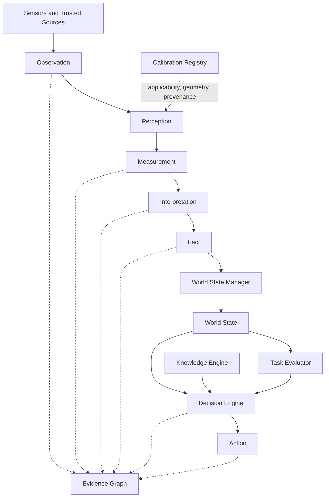

# SIE - Spatial Intelligence Engine

Engineering architecture for robotic perception, spatial reasoning and decision support.

## Baseline Scope

This README describes the historical pre-consolidation repository baseline formed from the local `main` and the available `origin/main` histories dated 2026-07-22.

It is a descriptive entry point, not a normative replacement for approved Engineering Specifications or `AI_CONTEXT.md`. Later operational calibration, runtime, and validation state is outside the scope of this baseline. Historical calibration results below must not be interpreted as identifying the current operational calibration.

## Vision

Robots should reason about the physical world using measurable, verifiable, and traceable information.

SIE transforms observations into calibrated measurements, evidence-backed world understanding, engineering decisions, and safe actions. Models and algorithms are replaceable implementation components, not sources of architectural authority.

## Engineering Principles

- Geometry First - spatial reasoning begins with geometry and physical constraints.
- Measured Reality over Predictions - predictions do not replace validated measurements.
- Evidence over Opinion - engineering conclusions require traceable evidence.
- Reference Frames Everywhere - every spatial value must declare an explicit `reference_frame` and physical unit.
- Replaceable AI Components - models may change without redefining the system architecture.
- Data Contracts Between Modules - modules exchange approved structured contracts rather than untyped internal state.
- Engineering Validation First - changes require reproducible physical validation before acceptance.
- Fail Closed - missing evidence, insufficient confidence, or failed calibration applicability must block promotion to a trusted measurement.

## Observation and Measurement

An `Observation` records what a sensor or trusted information source produced. Calibration does not produce an Observation.

A `Measurement` is a quantitative engineering result derived from Observation records using an applicable calibration or declared method. It must carry units, `reference_frame`, confidence, timestamp, provenance, and evidence linkage.

The local history adds the normative DM-008 requirement that every published Measurement include quantitative quality assessment and explainable evidence supporting acceptance or rejection. The historical Python scaffolding does not fully enforce DM-008 by construction, so object creation alone must not be treated as proof that the requirement passed.

## System Architecture



### Canonical Flow

1. Sensors and trusted information sources produce structured Observation records.
2. The Calibration Registry supplies applicability, geometry, and provenance. It does not create observations.
3. Perception components combine observations with applicable calibration to produce quantitative Measurement records.
4. Unknown, invalid, expired, or inapplicable calibration blocks Measurement emission.
5. Measurement records may support Interpretation, but Measurement and Interpretation remain distinct stages.
6. An Interpretation may produce a candidate Fact only when the claim is verifiable and linked to supporting evidence.
7. The World State Manager is the only component allowed to update entity-centric World State from valid Fact records.
8. The Task Evaluator assesses task state and outcomes. It does not make decisions.
9. The Decision Engine uses World State, Knowledge Engine rules, and Task Evaluator outputs to select an Action.
10. Every stage remains traceable through the Evidence Graph, and the complete processing cycle remains reproducible from declared inputs and versions.

### Architectural Boundaries

- Data Contracts cross module boundaries; OpenCV objects, NumPy arrays, tensors, and middleware messages remain implementation details.
- Spatial values without an explicit `reference_frame` are unusable for engineering decisions.
- World State contains only verifiable facts and may be updated only through its owning manager.
- Every Fact, World State update, Decision, and Action must remain traceable to source observations.
- Diagnostic estimates must remain separate from approved Measurements and World State.
- Insufficient confidence requires additional observation or safe refusal, not an unmarked best guess.

## Historical Implementation Status

At this pre-consolidation baseline, the repository contains early Vision Core and Geometry Engine implementations together with architecture and package scaffolding.

Implemented or represented in the historical tree:

- canonical `Observation` and `Measurement` dataclasses;
- stereo disparity, depth, ROI, quality, and geometry experiments under `sie_core`;
- `QualityReport` and `VisionFrameResult` prototypes;
- physical validation examples and tests;
- architecture, calibration, Evidence Graph, and World State documentation;
- early `sie` package scaffolding for contracts, evidence, geometry, measurements, decisions, temporal processing, and World State;
- CI, requirements, scripts, and configuration scaffolding.

Scaffold files and package presence do not imply completed runtime behavior or approved contract enforcement.

## Historical Validation Record

The following figures were recorded by the pre-consolidation branches for a historical stereo calibration baseline. They are retained for provenance only and do not identify the current operational calibration or authorize a runtime operating envelope.

### Stereo Calibration Baseline v2

| Metric | Historical value |
|---|---:|
| Stereo RMS | 0.479 px |
| Physical baseline | 65.10 mm |
| Solved baseline | 64.305 mm |
| Rectification median vertical error | 0.322 px |

### Historical Depth Checks

| Ground truth | Measured | Absolute error | Relative error |
|---|---:|---:|---:|
| 500 mm | 508.7 mm | 8.7 mm | 1.74% |
| 1000 mm | 1009.2 mm | 9.2 mm | 0.92% |

### Validation Methodology

The historical validation record describes:

- physically measured reference distances;
- frozen calibration parameters identified for the tested baseline;
- ROI-based median disparity estimation;
- repeated measurements;
- engineering acceptance criteria;
- cross-range checks;
- explicit separation between observed evidence and generalized performance claims.

Published metrics apply only to their recorded calibration, target, range, environment, and method. They are not general performance guarantees.

## Historical Repository Layout

The tree below describes the merged pre-consolidation Git baseline, not the final target architecture:

```text
SIE/
├── .github/              # CI and contribution templates
├── configs/              # Configuration scaffolding
├── decision_engine/      # Early decision-engine placeholder
├── docs/                 # Architecture and engineering documentation
├── examples/             # Example applications
├── experiments/          # Experiment scaffolding
├── geometry_engine/      # Geometry-engine placeholder
├── knowledge_engine/     # Knowledge-engine placeholder
├── scripts/              # Development and validation entry points
├── sie/                  # Emerging package layout, mostly scaffolding
├── sie_core/             # Implemented depth, geometry, quality, and contract prototypes
├── tests/                # Unit and validation tests
├── tools/                # Engineering utilities and placeholders
├── vision_core/          # Observation, Measurement, quality, and frame-result prototypes
└── README.md
```

The repository contains overlapping legacy and emerging package layouts. Their presence is historical evidence, not a decision that duplicate contracts or placeholder documents are canonical.

## Reproducibility Discipline

Engineering results should be reproducible from declared:

- source observations and evidence identifiers;
- calibration artifact and SHA-256;
- configuration and policy versions;
- software revision and dependency versions;
- hardware mapping and capture settings;
- reference frames and units;
- test method, acceptance criteria, and environmental conditions.

Historical validation environment recorded by these branches included Ubuntu 24.04, Python, OpenCV, ROS 2 Jazzy, MJPG stereo capture at 2560x800 and 60 FPS, and physical reference measurements. Calibration artifacts referenced by the historical README were stored externally and did not yet have a published repository artifact hash.

## Project Maturity

This baseline is an active research and engineering foundation. Public interfaces, package layout, and internal prototypes may change as approved architecture and Data Contracts are implemented.

README summaries are descriptive. Approved and frozen Engineering Specifications take precedence, followed by canonical architecture and Data Contract documents, then `AI_CONTEXT.md`.

## License

Copyright (c) 2026 SIE contributors. All rights reserved.

No open-source or commercial license is currently granted. See [LICENSE](LICENSE) for authoritative terms.
