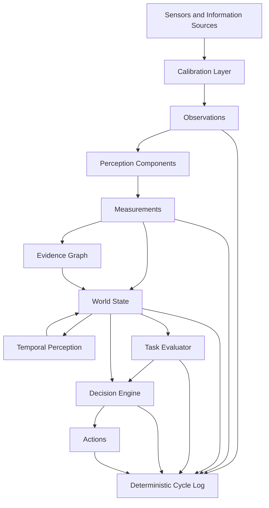

# SIE — Spatial Intelligence Engine
Engineering architecture for robotic perception, spatial reasoning and decision support.

## Vision

Robots should reason about the physical world using measurable, verifiable and traceable information.

SIE is an engineering architecture that transforms raw sensor observations into reliable spatial understanding for autonomous robotic systems.

Instead of relying on model-specific assumptions, SIE builds decisions upon calibrated measurements, geometry and explicit evidence.

## Why SIE

Modern robotic software often treats AI models as the primary source of truth.

SIE follows a different philosophy.

Measurements are trusted only after physical validation.

Every decision is traceable.

Every spatial value has an explicit reference frame.

Every conclusion can be verified.

## Engineering Principles

- Geometry First
- Measured Reality over Predictions
- Evidence over Opinion
- Reference Frames Everywhere
- Replaceable AI Components
- Data Contracts Between Modules
- Engineering Validation First

## System Architecture

SIE transforms raw sensor observations into traceable measurements, spatial facts and engineering decisions.

### Data Flow

1. Information sources produce structured `Observations`.
2. The Calibration Layer verifies sensor geometry, timing and applicability.
3. Perception components transform observations into quantitative `Measurements`.
4. Measurements are expressed in physical units and explicitly linked to a `reference_frame`.
5. The Evidence Graph preserves provenance from observation to measurement, decision and action.
6. The World State maintains the current structured representation of the physical environment.
7. Temporal Perception evaluates changes, stability and entity lifecycle across time.
8. The Task Evaluator assesses the World State against the active task.
9. The Decision Engine uses only the World State and Task Evaluator output to select an action.
10. The complete processing cycle is recorded in a deterministic log.

### Architectural Constraints

- Modules exchange structured Data Contracts rather than untyped internal data.
- Spatial values without an explicit `reference_frame` are invalid.
- Measurements produced under unknown, expired or unvalidated calibration are rejected.
- AI models are replaceable components and are not treated as authoritative sources of truth.
- Every engineering fact, decision and action must remain traceable to supporting evidence.
- Insufficient confidence must trigger additional observation, measurement or safe refusal.

## Current Status

SIE is currently in the engineering validation stage.

The active development focus is the Vision Core and calibration infrastructure required to produce physically meaningful spatial measurements.

### Completed

- Stereo camera calibration pipeline
- Correct physical left/right camera mapping
- Rectified stereo input pipeline
- ROI-based depth measurement
- Median-based distance estimation
- Temporal depth stabilization
- Confidence and measurement quality evaluation
- Cross-range stereo validation
- Geometry utilities for pixel-to-3D conversion
- Plane fitting experiments
- Measurement validation rules
- Versioned calibration concept and calibration applicability checks

### Active Development

- Stereo calibration v3 validation
- Calibration Registry
- Structured `Observation` and `Measurement` contracts
- Measurement uncertainty propagation
- Target-specific ROI validation
- Point cloud quality evaluation
- Object dimension measurement
- World State representation

### Planned

- Temporal Perception
- Entity lifecycle tracking
- Multi-sensor fusion
- IMU integration
- Visual-Inertial Odometry
- SLAM
- Task Evaluator
- Decision Engine
- Action validation and execution contracts

## Validation Results

Stereo calibration

RMS: 0.48 px

Baseline: 64.3 mm

500 mm target

Measured: 508.7 mm

Absolute error: 8.7 mm

1000 mm target

Measured: 1009 mm

Absolute error: 9 mm

## Repository Structure
sie/

docs/

vision_core/

geometry/

calibration/

measurements/

tools/

tests/

examples/

## Hardware Platform

Current development platform
- Raspberry Pi 5
- OV9281 Stereo Camera
- ESP32
- LeRobot SO-101
- VL53 ToF sensors (planned)
- IMU integration (planned)

## Reproducibility

Development environment
Ubuntu 24.04
Python
OpenCV
ROS2 Jazzy
Camera configuration
MJPG
2560×800
60 FPS
Auto Exposure = 3

## Roadmap

| Module | Status |
|---------|--------|
| Calibration | ✅ |
| Vision Core | ✅ |
| Geometry Engine | 🚧 |
| Point Cloud | 🚧 |
| Tracking | Planned |
| Sensor Fusion | Planned |
| World Model | Planned |
| Decision Engine | Planned |

## License

MIT License
