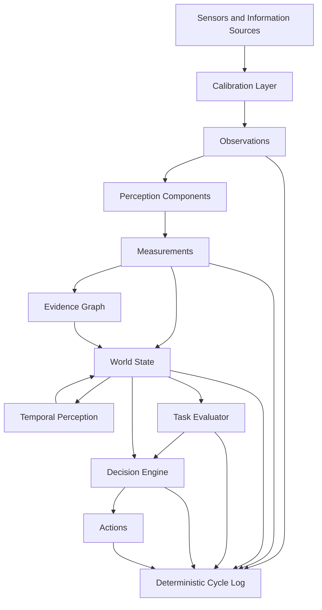

# SIE — Spatial Intelligence Engine
Engineering architecture for robotic perception, spatial reasoning and decision support.

## Vision

Robots should reason about the physical world using measurable, verifiable and traceable information.

SIE is an engineering architecture that transforms raw sensor observations into reliable spatial understanding for autonomous robotic systems.

Instead of relying on model-specific assumptions, SIE builds decisions upon calibrated measurements, geometry and explicit evidence.

## Why SIE

Modern robotic software often treats AI models as the primary source of truth.

SIE follows a different philosophy.

Measurements are trusted only after physical validation.

Every decision is traceable.

Every spatial value has an explicit reference frame.

Every conclusion can be verified.

## Engineering Principles

- Geometry First
- Measured Reality over Predictions
- Evidence over Opinion
- Reference Frames Everywhere
- Replaceable AI Components
- Data Contracts Between Modules
- Engineering Validation First

## System Architecture

SIE transforms raw sensor observations into traceable measurements, spatial facts and engineering decisions.

## Current Status

### Completed

- Stereo camera calibration
- ROI depth measurement
- Confidence Engine
- Geometry Engine
- Cross-range validation
- Measurement validation

### In Progress

- Point cloud generation
- Object measurement
- Plane fitting
- World State representation

### Planned

- Sensor fusion
- Visual-Inertial Odometry
- SLAM
- Decision Engine

## Validation Results

Stereo calibration

RMS: 0.48 px

Baseline: 64.3 mm

500 mm target

Measured: 508.7 mm

Absolute error: 8.7 mm

1000 mm target

Measured: 1009 mm

Absolute error: 9 mm

## Repository Structure
sie/

docs/

vision_core/

geometry/

calibration/

measurements/

tools/

tests/

examples/

## Hardware Platform

Current development platform
- Raspberry Pi 5
- OV9281 Stereo Camera
- ESP32
- LeRobot SO-101
- VL53 ToF sensors (planned)
- IMU integration (planned)

## Reproducibility

Development environment
Ubuntu 24.04
Python
OpenCV
ROS2 Jazzy
Camera configuration
MJPG
2560×800
60 FPS
Auto Exposure = 3

## Roadmap

| Module | Status |
|---------|--------|
| Calibration | ✅ |
| Vision Core | ✅ |
| Geometry Engine | 🚧 |
| Point Cloud | 🚧 |
| Tracking | Planned |
| Sensor Fusion | Planned |
| World Model | Planned |
| Decision Engine | Planned |

## License

MIT License
